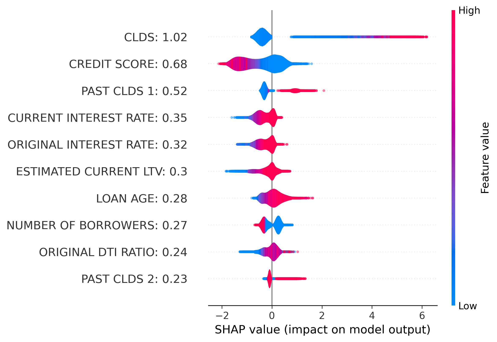

# Machine Learning Models for Loan Classification Using Real World Data

## 📄 [View the Full Project Documentation Here](./240924_ML_LoanPredictor_FreddieMacReport.pdf)

> **Note:** This README provides a high-level summary of the project. For detailed methodology, complete results, and technical explanations, please refer to the full project documentation available [here](./240924_ML_LoanPredictor_FreddieMacReport.pdf).

---

## Author:
Natalya Sheremetyeva  

---

## Abstract

In this project, I developed a machine learning model for loan performance classification using XGBoost trained on real-world data from Freddie Mac’s Single-Family Loan-Level dataset. Key features, such as Current Loan Delinquency Status (CLDS) and the engineered Estimated Loan-to-Value (ELTV) feature, emerged as important predictors for the model, as determined by SHAP values. The model achieved an average ROC AUC score of 0.94 on the unseen test set. Class imbalance was addressed using undersampling techniques, increasing the focus on predicting non-performing loans. While the model demonstrated robust performance with an 82.9% profit advantage over a random baseline from 2014-2017, performance declined slightly in later years, highlighting the need for periodic retraining to maintain accuracy in evolving market conditions.

**For full details of the methodology, performance metrics, and analysis, please refer to the complete project documentation [here](./240924_ML_LoanPredictor_FreddieMacReport.pdf).**

---

## Introduction

Lenders need to manage risk and allocate capital efficiently to maintain financial stability. Loan classification, a crucial part of credit risk assessment, involves predicting whether a loan will perform well or default. This helps lenders make informed decisions about loan approvals, interest rates, and credit limits.

Loan classification models also help lenders meet regulatory requirements and reduce financial losses. Accurate loan classification is critical in the current economic environment, with fluctuating interest rates, inflation concerns, and economic uncertainty. Recent events like the collapse of Silicon Valley Bank and the buyout of First Republic Bank by JPMorgan emphasize the importance of predictive models for safeguarding the stability of financial institutions and the broader economy.

---

## Target Engineering

The goal of this project is to predict whether a loan will perform well or become non-performing within the following two years. A loan is considered non-performing if it has a delinquency status of four months or more (CLDS = 4).

  
*Figure 1: The percentage of matured and default loans across different CLDS values (months delinquent). The CLDS=4 value offers a good separation between matured and default loans, as the gap between the two classes becomes substantial at that point, making it an effective threshold for defining non-performing loans.*

---

## Model Performance

| Data sets       | Training | Validation | Test           |Test           |Test           |Test           |Test           |
|-----------------|----------|------------|----------------|----------------|----------------|----------------|----------------|
| Year            | 1999-2011| 2012-2013  | 2014           |2015            |2016            |2017            |2018            |
| ROC AUC         | 0.999    | 0.967      | 0.948     |0.946    |0.933    |0.931    |0.804    |

---

### Interpretability

To address interpretability, SHAP (SHapley Additive exPlanations) values were used to explain the model. SHAP values assign each feature a contribution value, helping to identify how much each feature influences the model’s output.

  
*Figure 2: SHAP summary plot for the top ten most important features influencing the model's predictions.*

---

## Conclusion

In summary, the XGBoost model performed well, achieving high accuracy in predicting loan performance. Over time, the model’s accuracy declined slightly due to changing market conditions, but this could be addressed by retraining the model periodically.

---

For complete details, please refer to the full project documentation:  
📄 [**View the Full Project Documentation Here**](./240924_ML_LoanPredictor_FreddieMacReport.pdf)
