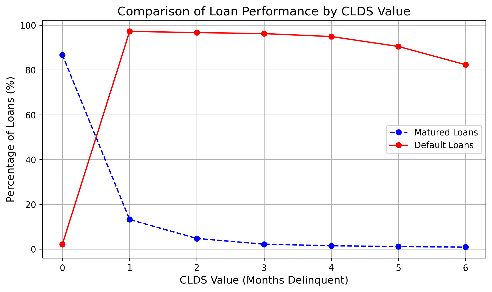

# ml-freddie
AI/ML models for Loan Risk Assessment
[View the Full Project Documentation Here](./240924_ML_LoanPredictor_FreddieMacReport.pdf)

# Machine Learning Models for Loan Classification Using Real World Data

## Author:
Natalya Sheremetyeva  
Email: [natalya.sheremetyeva@gmail.com](mailto:natalya.sheremetyeva@gmail.com)  

---

## Abstract

In this project, I developed a machine learning model for loan performance classification using XGBoost trained on real-world data from Freddie Mac’s Single-Family Loan-Level dataset. Key features, such as Current Loan Delinquency Status (CLDS) and the engineered Estimated Loan-to-Value (ELTV) feature, emerged as important predictors for the model, as determined by SHAP values. The model achieved an average ROC AUC score of 0.94 on the unseen test set. Class imbalance was addressed using undersampling techniques, increasing the focus on predicting non-performing loans. While the model demonstrated robust performance with an 82.9% profit advantage over a random baseline from 2014-2017, performance declined slightly in later years, highlighting the need for periodic retraining to maintain accuracy in evolving market conditions.

---

## Introduction

Lenders need to manage risk and allocate capital efficiently to maintain financial stability. Loan classification, a crucial part of credit risk assessment, involves predicting whether a loan will perform well or default. This helps lenders make informed decisions about loan approvals, interest rates, and credit limits.

Loan classification models also help lenders meet regulatory requirements and reduce financial losses. Accurate loan classification is critical in the current economic environment, with fluctuating interest rates, inflation concerns, and economic uncertainty. Recent events like the collapse of Silicon Valley Bank and the buyout of First Republic Bank by JPMorgan emphasize the importance of predictive models for safeguarding the stability of financial institutions and the broader economy.

The objectives of this project are:
1. To train a machine learning classifier that predicts loan performance.
2. To optimize the classifier through hyperparameter tuning and model selection techniques.
3. To identify key features influencing loan outcomes, providing insights into loan performance.

The report is structured as follows: I first discuss the design of the target variable and its connection to loan performance. Then, key model performance metrics are presented, followed by an analysis of feature importance and model stability. The technical details of the model development process are in Section 2.

---

## Target Engineering

The goal of this project is to predict whether a loan will perform well or become non-performing within the following two years. A loan is considered non-performing if it has a delinquency status of four months or more (CLDS = 4).

Initially, the Zero Balance Code (ZBC) was considered as a target variable. However, since ZBC is only populated when a loan reaches a zero balance (e.g., paid off or defaulted), it does not provide an early warning signal. Therefore, CLDS was used as a proxy for default.

Loans with CLDS = 4 provide a reliable separation between non-performing and matured loans. By choosing CLDS = 4 as the threshold for default, the model effectively distinguishes loans that will default from those that will mature.

  
*Figure 1: The percentage of matured and default loans across different CLDS values (months delinquent). The CLDS=4 value offers a good separation between matured and default loans, as the gap between the two classes becomes substantial at that point, making it an effective threshold for defining non-performing loans.*

---
